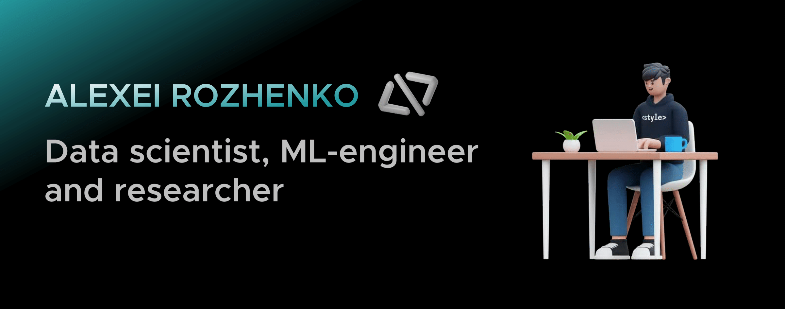

## Hi, I'm Alexei 

After realizing that a global AI-tization is inevitable yet a thrilling journey, I became a Data Scientist. 
### About me:
1. Experience of working as an independent DS researcher for **more than 1.5 years**
2. Having **more than 20 Q-1 publications** (WoS, Scopus)
3. Making the ML-based web application for **China Oilfield Services Limited (COSL)**

### My stack

 
 

